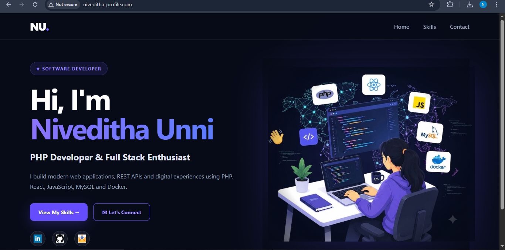
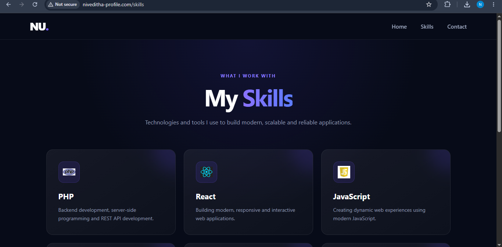
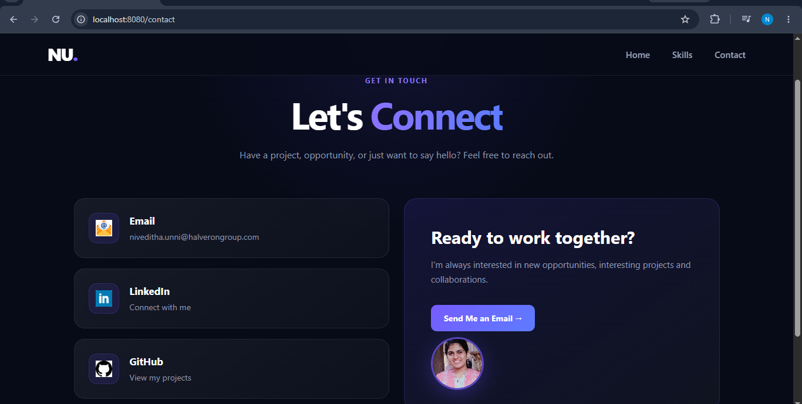

# Digital Business Card

A modern and responsive 3-page digital business card built with **React**, **React Router**, **Docker**, and **Nginx**.

The application includes Home, Skills, and Contact pages and is deployed inside a Docker container using Nginx as the production web server.

---

##  Screenshots

###  Home



###  Skills



###  Contact



---

##  Features

- Modern and responsive UI
- Three-page digital business card
- React Router navigation
- Home, Skills, and Contact pages
- Professional dark-themed design
- Social media links
- Email contact integration
- Technical skills showcase
- Docker containerization
- Nginx production server
- Client-side routing support
- React routes work correctly after browser refresh

---

##  Pages

###  Home

The Home page introduces the developer and provides social media links.

###  Skills

The Skills page showcases technical skills and technologies:

- PHP
- React
- JavaScript
- MySQL
- MongoDB
- Java
- Docker
- AWS
- Qdrant

###  Contact

The Contact page provides:

- Email
- LinkedIn
- GitHub
- Contact action
- Developer profile section

---

##  Technologies Used

| Technology | Purpose |
|------------|---------|
| React | Frontend development |
| React Router | Client-side routing |
| Vite | Development and production build |
| CSS | Styling and responsive design |
| Docker | Application containerization |
| Nginx | Production web server |

---

#  Project Structure

```text
digital-business-card/
│
├── public/
│   ├── icons/
│   │   ├── linkedin.png
│   │   ├── github.png
│   │   ├── email.png
│   │   ├── php.png
│   │   ├── react.png
│   │   ├── javascript.png
│   │   ├── mysql.png
│   │   ├── docker.png
│   │   ├── aws.png
│   │   ├── java.png
│   │   ├── mongodb.png
│   │   └── qdrant.png
│   │
│   ├── developer.png
│   └── profile.png
│
├── src/
│   ├── pages/
│   │   ├── Home.jsx
│   │   ├── Skills.jsx
│   │   └── Contact.jsx
│   │
│   ├── App.jsx
│   ├── App.css
│   ├── index.css
│   └── main.jsx
│
├── screenshots/
│   ├── home.png
│   ├── skills.png
│   └── contact.png
│
├── .gitignore
├── Dockerfile
├── nginx.conf
├── package.json
├── package-lock.json
└── README.md
